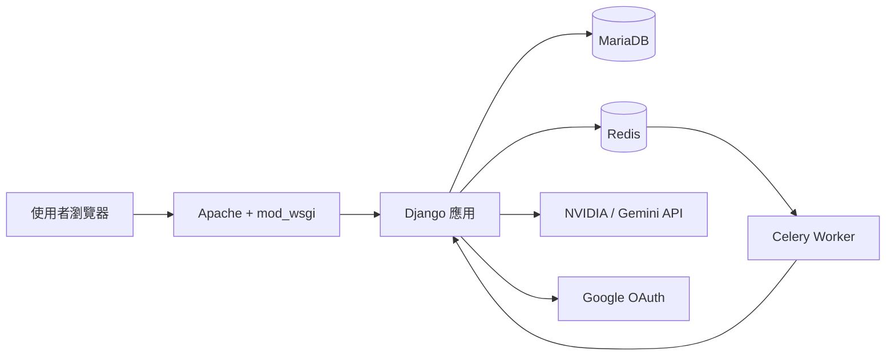
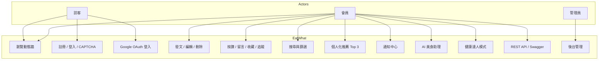
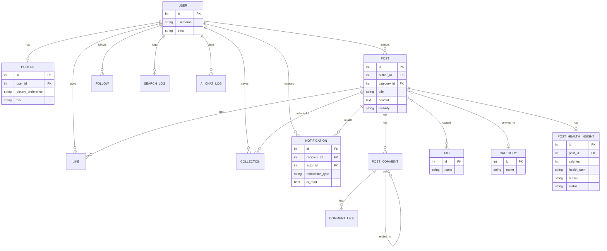
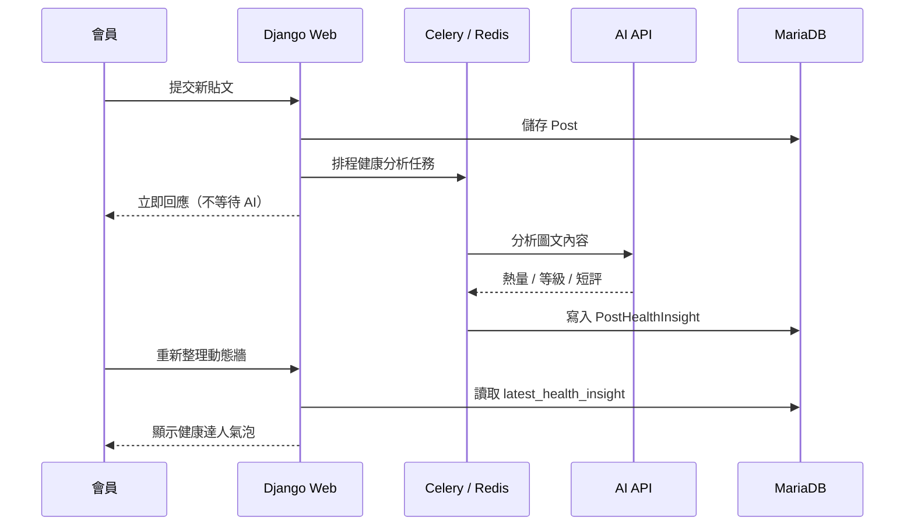
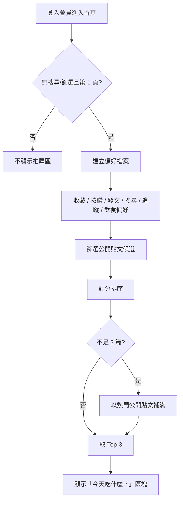

# EatWhat 報告用圖表（Mermaid）

可直接複製到支援 Mermaid 的編輯器（GitHub、Typora、VS Code 外掛），或匯出成 PNG 貼進 Word / PowerPoint。

---

## 1. 系統架構（部署）

---

## 2. 用例圖（Use Case）

---

## 3. ERD（實體關聯圖）

---

## 4. 發文與健康分析流程

---

## 5. 個人化推薦流程

---

## 匯出成圖片的方式

1. **GitHub**：將本檔 push 後在 repo 內預覽，截圖 Mermaid 區塊
2. **Mermaid Live Editor**：<https://mermaid.live/> 貼上程式碼後 Export PNG/SVG
3. **VS Code**：安裝 Mermaid 外掛後預覽並匯出
