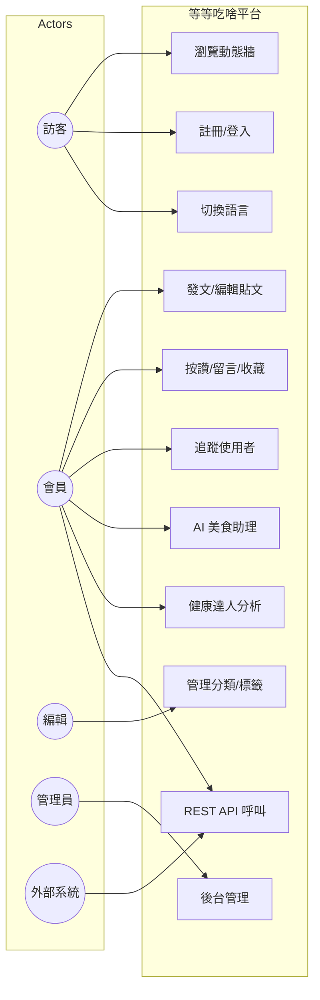
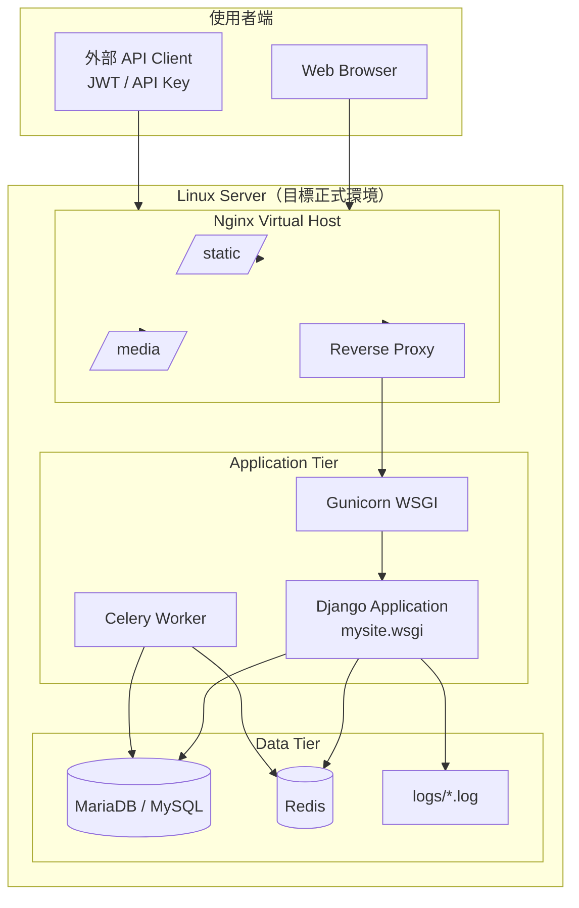
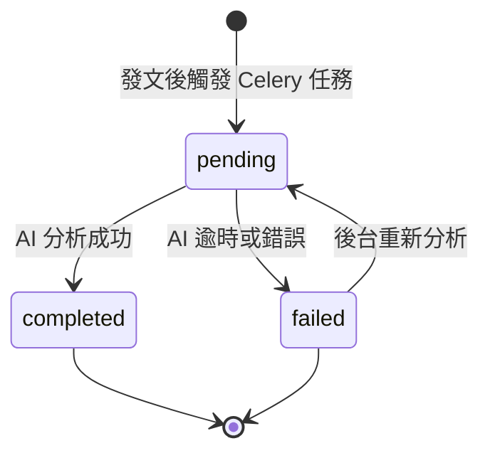
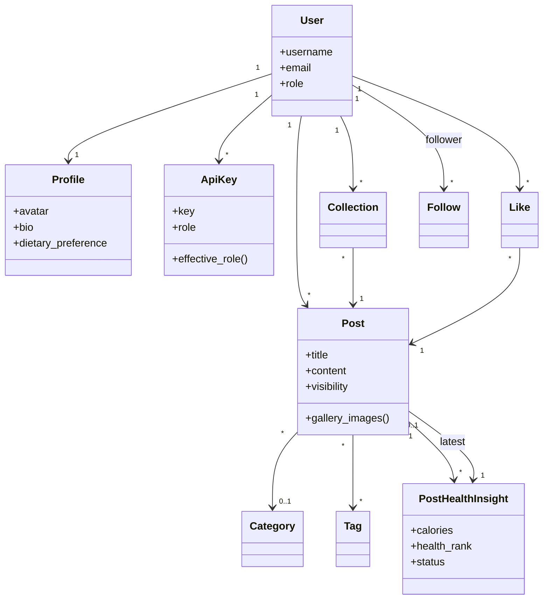

# 等等吃啥 — 系統圖表（報告用）

本文件包含用例圖、ERD、部署圖；加分項目含狀態圖與活動圖。  
可在 [Mermaid Live Editor](https://mermaid.live) 或支援 Mermaid 的 Markdown 編輯器預覽。

> **環境說明**
> - **本機開發**：Windows 上執行 `python manage.py runserver`（Django 開發伺服器）
> - **目標正式環境**：Linux + Nginx Virtual Host + Gunicorn WSGI（設定見 `deploy/README.md`）
> - 下列部署圖描述的是**目標正式架構**，不代表目前已部署至虛擬機

---

## 1. 用例圖（Use Case Diagram）



---

## 2. ERD（實體關係模型）

對應 `accounts`、`posts` 等 app 的 ORM 與資料表名稱。

```mermaid
erDiagram
    USERS ||--|| PROFILES : has
    USERS ||--o{ API_KEYS : owns
    USERS ||--o{ POSTS : authors
    USERS ||--o{ LIKES : gives
    USERS ||--o{ COLLECTIONS : saves
    USERS ||--o{ FOLLOWS : follower
    USERS ||--o{ FOLLOWS : following
    USERS ||--o{ POST_COMMENT : writes
    USERS ||--o{ AI_CHAT_LOGS : chats
    USERS ||--o{ SEARCH_LOGS : searches

    CATEGORIES ||--o{ POSTS : categorizes
    TAGS }o--o{ POSTS : tags

    POSTS ||--o{ LIKES : receives
    POSTS ||--o{ COLLECTIONS : collected_in
    POSTS ||--o{ POST_COMMENT : has
    POSTS ||--o{ POST_HEALTH_INSIGHTS : has_many
    POSTS }o--o| POST_HEALTH_INSIGHTS : latest_pointer

    POST_COMMENT ||--o{ POST_COMMENT_LIKES : receives
    POST_COMMENT ||--o| POST_COMMENT : replies_to

    USERS {
        bigint id PK
        varchar username UK
        varchar email UK
        varchar password
        varchar role
        datetime created_at
    }

    PROFILES {
        bigint user_id PK_FK
        varchar avatar
        text bio
        varchar dietary_preference
    }

    API_KEYS {
        bigint id PK
        bigint user_id FK
        varchar key UK
        varchar role
        bool is_active
    }

    POSTS {
        bigint id PK
        bigint user_id FK
        bigint category_id FK
        bigint latest_health_insight_id FK
        varchar title
        text content
        varchar visibility
        int like_count
        datetime created_at
    }

    CATEGORIES {
        bigint id PK
        varchar name
    }

    TAGS {
        bigint id PK
        varchar name
    }

    FOLLOWS {
        bigint id PK
        bigint follower_id FK
        bigint following_id FK
    }

    POST_HEALTH_INSIGHTS {
        bigint id PK
        bigint post_id FK
        int calories
        char health_rank
        varchar reason
        varchar status
    }
```

---

## 3. 部署圖（Deployment Diagram）

**目標正式環境**（Linux 伺服器或虛擬機）。本機 demo 以 `runserver` 取代 Gunicorn + Nginx。



---

## 4. 狀態圖 — 貼文健康分析（加分）

對應 `PostHealthInsight.status`：`pending` → `completed` / `failed`；後台可重新觸發分析。



---

## 5. 活動圖 — 使用者登入（加分）

對應登入表單：帳密 + CAPTCHA +「我不是機器人」勾選。

```mermaid
flowchart TD
    A[開啟登入頁] --> B[輸入帳號或 Email / 密碼]
    B --> C[輸入 CAPTCHA]
    C --> D{勾選我不是機器人?}
    D -- 否 --> E[顯示錯誤]
    E --> B
    D -- 是 --> F{驗證碼正確?}
    F -- 否 --> G[Refresh CAPTCHA]
    G --> C
    F -- 是 --> H{帳密正確?}
    H -- 否 --> I[寫入 security.log]
    I --> E
    H -- 是 --> J[建立 Session]
    J --> K[導向動態牆]
    K --> [*]
```

---

## 6. 類別圖（ORM 對映摘要）


